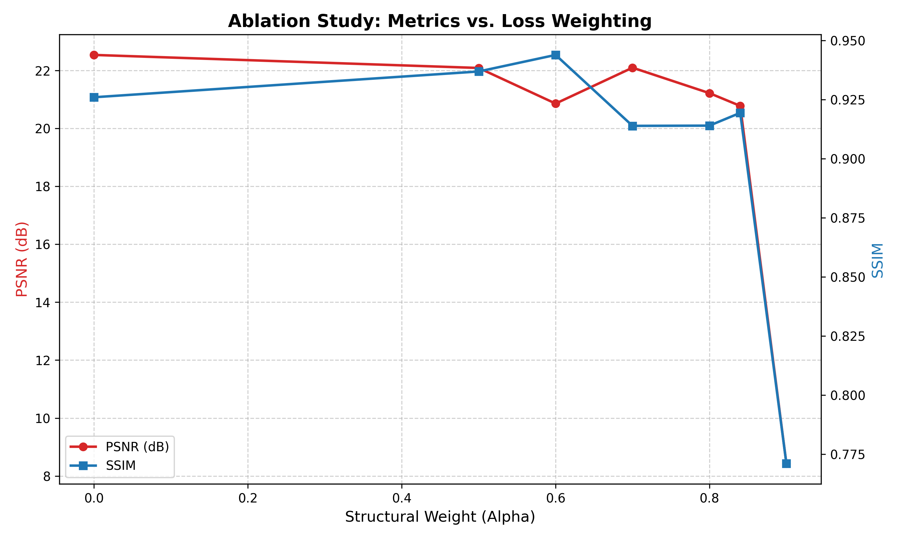
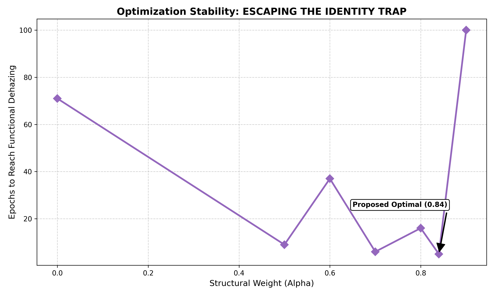
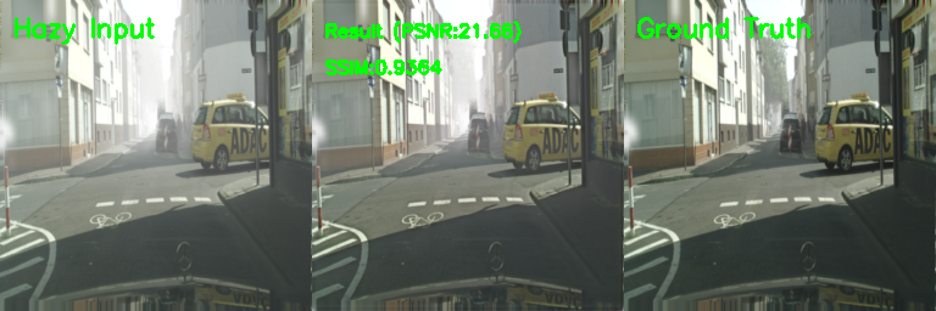
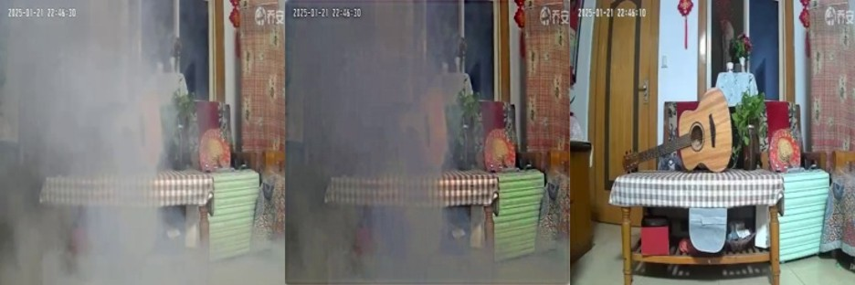
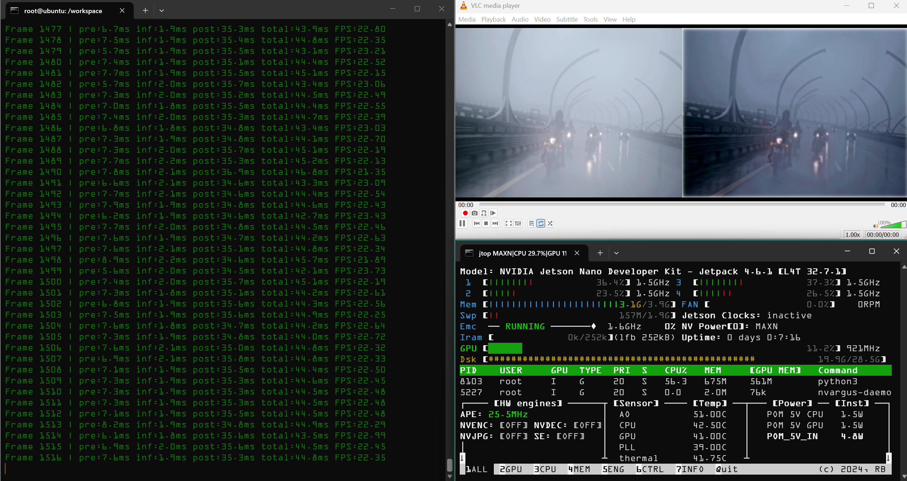
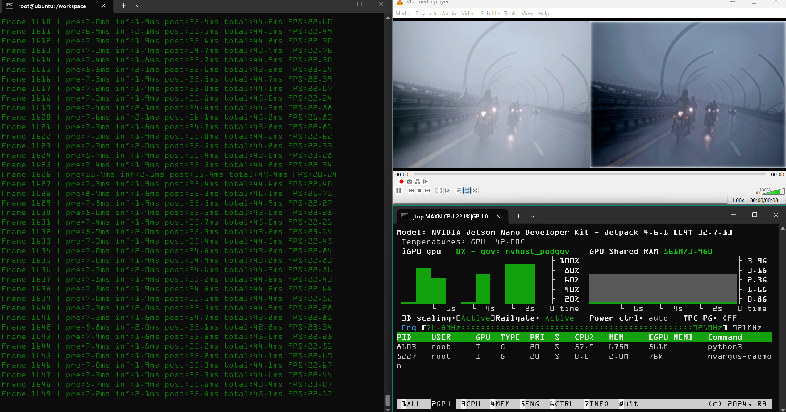
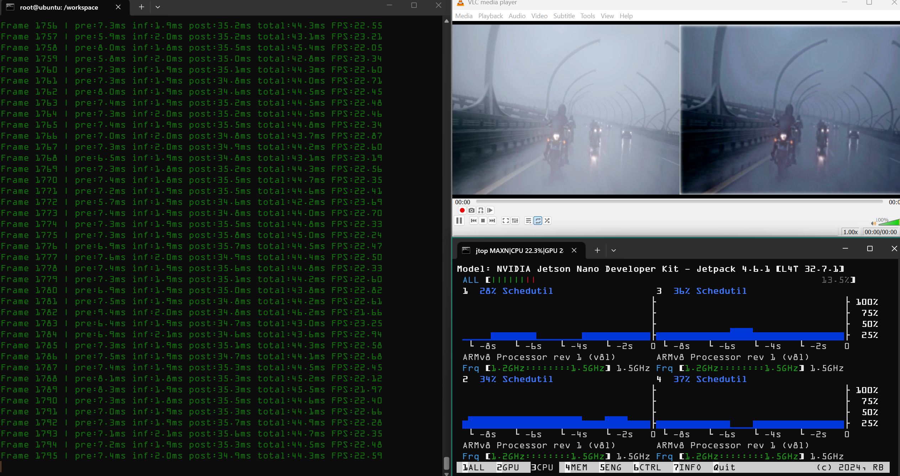
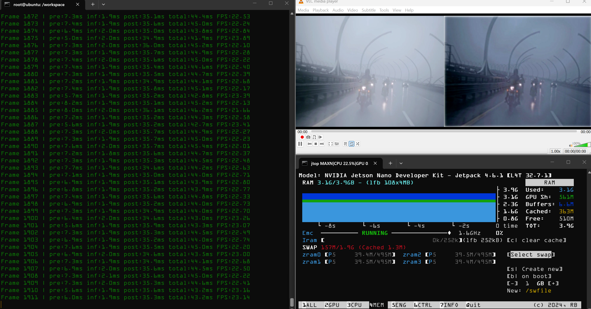
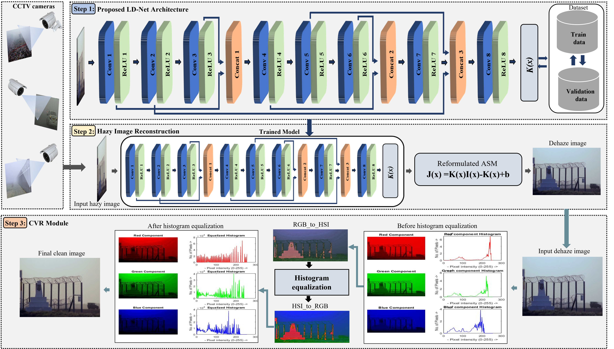

# LightDehazeNet on Jetson Nano

[](https://www.python.org/)
[](https://pytorch.org/)
[](https://developer.nvidia.com/tensorrt)
[](https://developer.nvidia.com/embedded/jetson-nano)
[](https://www.docker.com/)

End-to-end deployment of **LightDehazeNet** on **NVIDIA Jetson Nano** — trained with a custom Hybrid MS-SSIM + L₁ loss, accelerated via TensorRT FP16 engine conversion, and served as a real-time MJPEG dehazing web stream.

---

## Overview

| | |
|---|---|
| **Custom Loss** | Hybrid MS-SSIM + L₁ (α = 0.84) — 93% faster convergence vs. L₁ baseline |
| **Benchmark** | FoggyCityscapes: PSNR **22.99 dB** / SSIM **0.9214**  ·  SmokeBench: PSNR **19.32 dB** / SSIM **0.7614** |
| **TensorRT FP16** | PyTorch `.pth` → TensorRT engine via `torch2trt`, fixed 256×256 input |
| **Edge Streaming** | Real-time side-by-side dehazing served as MJPEG over Flask on Jetson Nano |

---

## Training — Custom Loss & Ablation Study

Standard L₁ and MSE-trained dehazing models exhibit an **Identity Trap**: the network learns to pass hazy inputs through unchanged for up to 70 epochs before achieving any meaningful dehazing. We resolved this with a perceptual-structural loss formulation:

$$\mathcal{L} = 0.84 \cdot \mathcal{L}_{\text{MS-SSIM}} + 0.16 \cdot \mathcal{L}_{L1}$$

The MS-SSIM term prioritizes multi-scale structural and edge recovery; the L₁ term stabilizes global luminance and prevents color drift.

### Alpha Ablation

| α | PSNR (dB) | SSIM | Notes |
|:---:|:---:|:---:|:---|
| 0.00 (L₁ baseline) | 22.54 | 0.9260 | Identity Trap — ~70 epochs before dehazing initiates |
| 0.50 | 22.09 | 0.9369 | Slow structural convergence |
| 0.60 | 20.86 | **0.9439** | Peak SSIM, but high startup latency |
| 0.70 | 22.10 | 0.9139 | Moderate stability |
| 0.80 | 21.22 | 0.9140 | Improved convergence |
| **0.84 (proposed)** | **20.78** | **0.9194** | Breakthrough at Epoch 5 — 93% latency reduction |
| 0.90 | 8.43 | 0.7711 | Optimization collapse |

| PSNR & SSIM vs. Alpha | Convergence — Escaping the Identity Trap |
|:---:|:---:|
|  |  |

**Key finding:** α = 0.84 acts as an optimization catalyst. The model achieves functional dehazing at Epoch 5 (compared to ~70 for L₁), while α ≥ 0.90 leads to stochastic collapse.

---

## Benchmark Results

| Training Data | Test Set | PSNR | SSIM |
|:---|:---|:---:|:---:|
| FoggyCityscapes + SmokeBench | FoggyCityscapes | **22.99 dB** | **0.9214** |
| FoggyCityscapes + SmokeBench | SmokeBench | **19.32 dB** | **0.7614** |
| FoggyCityscapes only | FoggyCityscapes | 22.37 dB | 0.9137 |

### FoggyCityscapes — Qualitative Output


### SmokeBench — Qualitative Output


---

## Zero-Shot Real-World Video Inference

The TensorRT FP16 engine was tested on `bikers.mp4` — an unseen internet video the model was never trained on. Output is streamed side-by-side (hazy | dehazed) at real-time frame rates via Flask on Jetson Nano.

| Frame 1 | Frame 2 |
|:---:|:---:|
|  |  |

| Frame 3 | Frame 4 |
|:---:|:---:|
|  |  |

---

## Architecture



LightDehazeNet is a compact 8-layer CNN (~0.21M parameters) with three concatenated skip connections. Rather than estimating the transmission map and atmospheric light as separate sub-tasks, it directly applies a reformulated Atmospheric Scattering Model:

$$J(x) = K(x) \cdot I(x) - K(x) + 1$$

where $K(x)$ is the Conv8 output and $I(x)$ is the hazy input.

---

## Deployment Pipeline

```
PyTorch checkpoint   →   torch2trt (FP16)   →   TensorRT engine   →   Flask MJPEG stream
trained_LDNet.pth                               ldnet_trt.pth         http://<jetson>:5000
```

---

## Repository Structure

```
.
├── src/
│   ├── model.py            # LightDehaze_Net architecture (~0.21M params)
│   ├── inference.py        # Model loader and preprocessing helpers
│   ├── cvr.py              # Color Visibility Restoration (CLAHE post-processing)
│   └── model_info.py       # Layer-wise parameter counter
│
├── scripts/
│   ├── convert_trt.py          # PyTorch → TensorRT FP16 conversion
│   ├── infer_image.py          # Single image dehazing
│   ├── infer_batch.py          # Batch image dehazing
│   ├── stream_live_camera.py   # Live Jetson camera MJPEG stream (TRT)
│   ├── stream_video_file.py    # Video file MJPEG stream (TRT)
│   └── camera_raw_stream.py    # Raw camera passthrough (debug)
│
├── notebooks/
│   └── evaluation_plots.ipynb  # PSNR/SSIM ablation and metric visualizations
│
├── assets/                 # Architecture diagram, ablation plots, result images
│   └── screenshots/        # Zero-shot bikers.mp4 inference frames
│
├── weights/
│   ├── trained_LDNet.pth   # Trained PyTorch checkpoint
│   ├── ldnet_trt.pth       # TensorRT FP16 engine
│   └── README.md           # Weights download guide
│
├── samples/                # Test images (indoor/outdoor, synthetic/natural haze)
├── docker/SETUP.md         # Container load and run guide
├── Dockerfile
├── run_container.sh
└── requirements.txt
```

---

## Quickstart

```bash
# Load and launch the Docker container on Jetson
docker load -i my_jetson_env.tar
bash run_container.sh

# Convert PyTorch checkpoint to TensorRT FP16
python scripts/convert_trt.py

# Live camera dehazing stream
python scripts/stream_live_camera.py
# Open http://<jetson-ip>:5000

# Video file dehazing stream (side-by-side)
python scripts/stream_video_file.py
# Open http://<jetson-ip>:5000

# Single image
python scripts/infer_image.py -i samples/outdoor_synthetic/soh(1).jpg

# Batch inference on a directory
python scripts/infer_batch.py -td samples/outdoor_natural/
```

See [docker/SETUP.md](docker/SETUP.md) for detailed container setup and GPU/camera verification.

---

## Citation

```bibtex
@article{ullah2021light,
  title={Light-DehazeNet: A Novel Lightweight CNN Architecture for Single Image Dehazing},
  author={Ullah, Hayat and Muhammad, Khan and Irfan, Muhammad and Anwar, Saeed and
          Sajjad, Muhammad and Imran, Ali Shariq and De Albuquerque, Victor Hugo C},
  journal={IEEE Transactions on Image Processing},
  year={2021},
  publisher={IEEE}
}
```

## Acknowledgements

- [Light-DehazeNet](https://github.com/hayatkhan8660-maker/Light-DehazeNet) — Hayat Ullah et al., IEEE TIP 2021
- [torch2trt](https://github.com/NVIDIA-AI-IOT/torch2trt) — NVIDIA AI-IOT
